# Description
This chrome extension is built to help users to track their daily tasks, set work and break time, set an Alarm and block the URLs which they find distracting.

# Tech Stack
#### Front-end : `HTML, CSS, jQuery and Javascript`
#### Database : [chrome.storage](https://developer.chrome.com/docs/extensions/reference/storage/)  and [window.localStorage](https://developer.mozilla.org/en-US/docs/Web/API/Window/localStorage)

# Guidelines to Setup

1. Clone the project
    ```
    git clone https://github.com/moron-coder/productivity-mgmt-extension.git
    ```
2. Connect to Chrome in your PC
* `Load unpack` this repository in extension menu
3. Make sure the [sync](https://support.google.com/chrome/answer/185277?co=GENIE.Platform%3DDesktop&hl=en-GB) option is turned on 
4. Make sure Chrome is allowed to show [notifications](https://support.microsoft.com/en-us/windows/change-notification-settings-in-windows-10-ddcbbcd4-0a02-f6e4-fe14-6766d850f294). 

# Features
The features of the app can be broadly described into 2 parts:
- Popup page: It is the window which pops up when the user clicks the icon of the extension.
    - It sets the time users want to assign themselves for work and for break. Additionally, it also provides users an option to pause/reset the timer. 
- Home page: It is the tab which opens when the user clicks the `home` icon present in popup. It has the following 3 features
    - To do list : It enables users to add/delete task in their to do list. In addition, users can modify the state of a given task as done/not done. 
    - Alarm : Users can set a reminder for any task through this option. For alarm to work, the user must enable notifications and provide chrome the permission to send notifications. 
    - URL blocker : If users find some urls distracting, they can type the url under the given text area and `enable` this blocker and click on `save` option. If the `enable` option is unchecked, the changes are restored and this feature stops functioning.


# Screenshots
## Pop-up


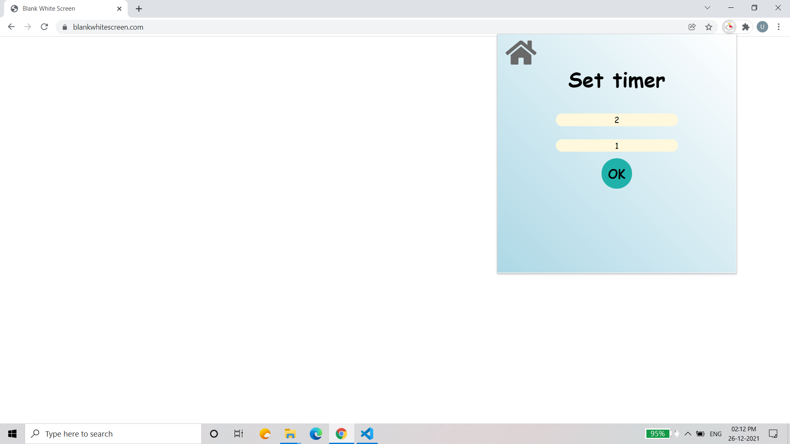
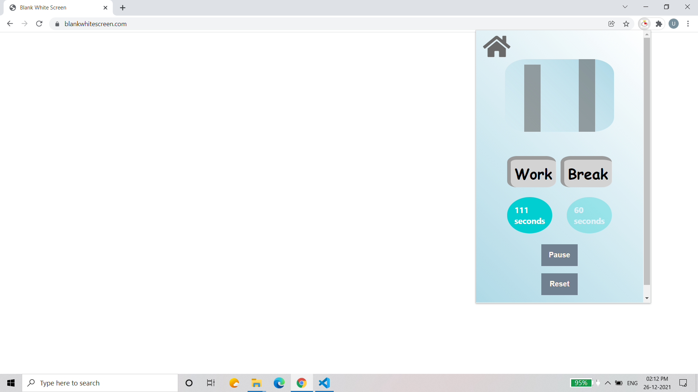
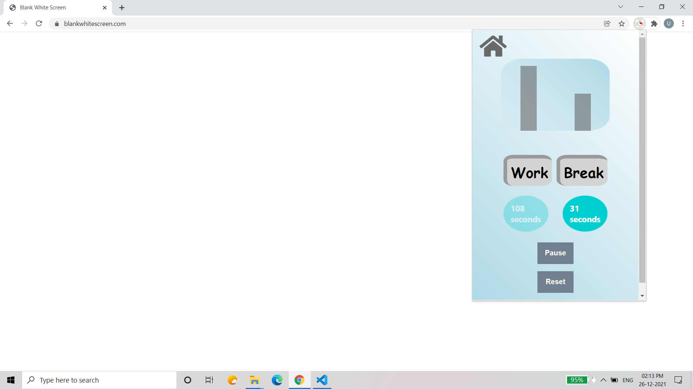
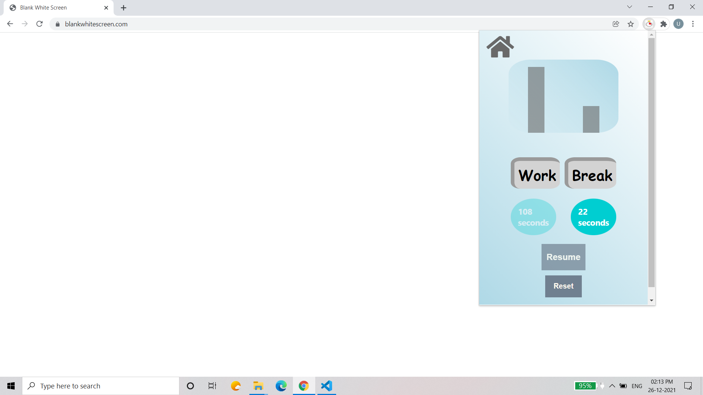
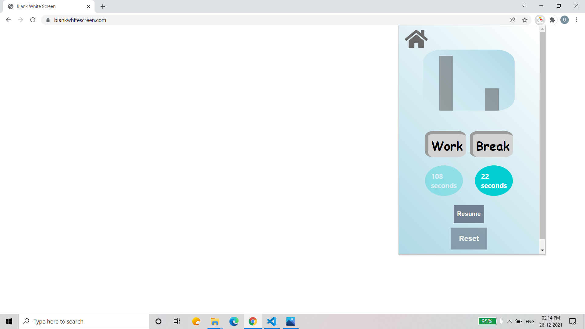
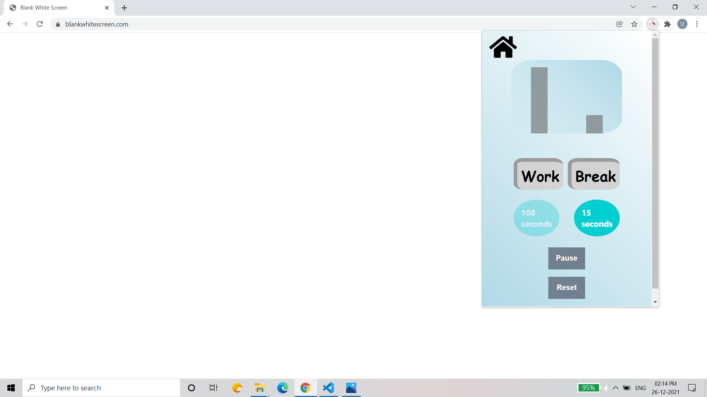
## Home 
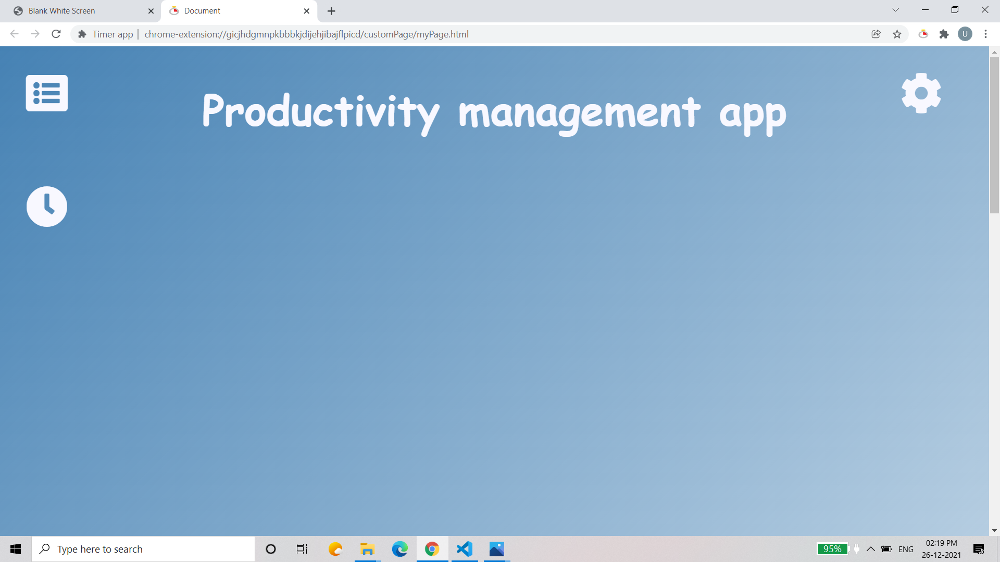
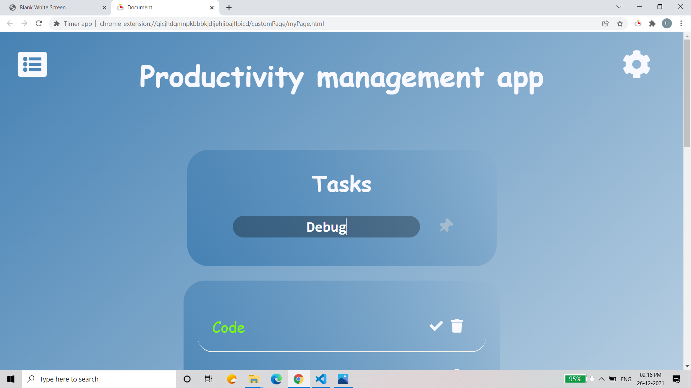
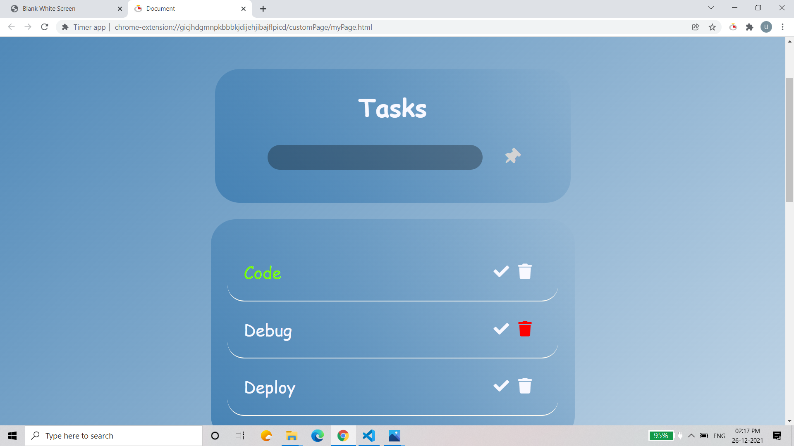
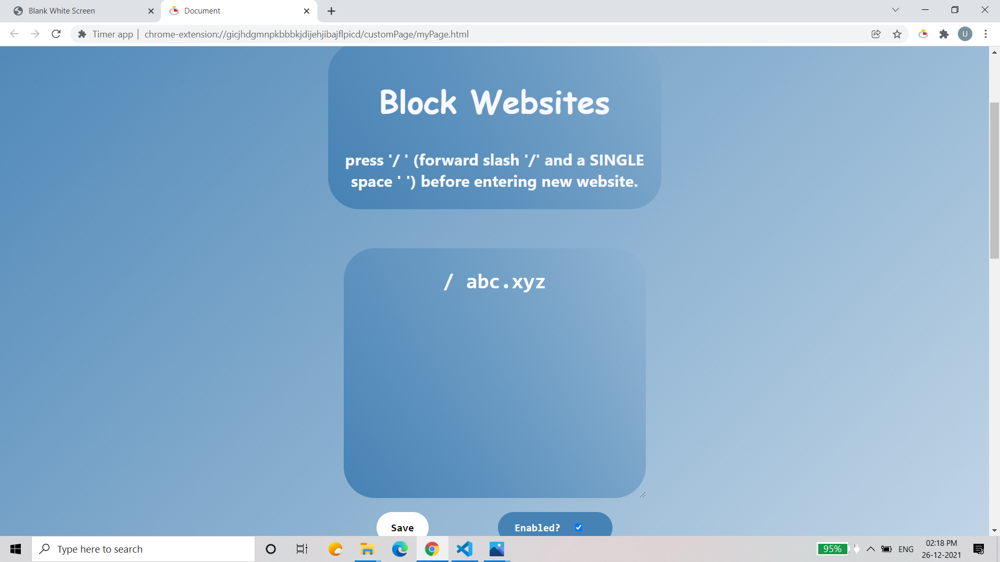
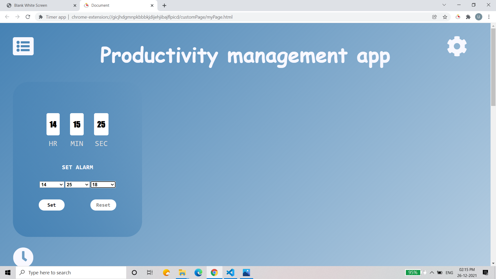

## Author
- [Utkarsh Kumar](https://github.com/moron-coder)