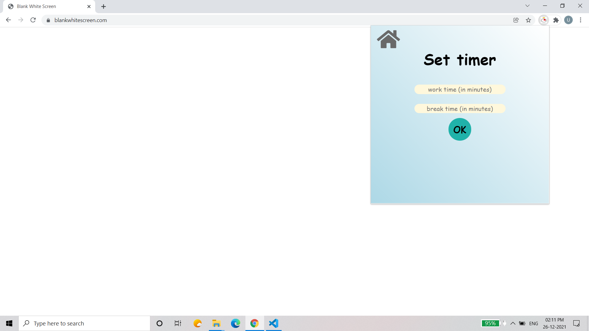

# Description
As a team of 3 developers, we built this chrome extension to help user to track his/her Daily tasks, Work time, Set an Alarm and to block some unnecessary URL's.

# Tech Stack
#### Front-end : `HTML, CSS, jQuery and Javascript`
#### Database : [chrome.storage](https://developer.chrome.com/docs/extensions/reference/storage/)  and [window.localStorage](https://developer.mozilla.org/en-US/docs/Web/API/Window/localStorage)

# Guidelines to Setup

1. Clone the project
    ```
    git clone https://github.com/Nirav1510/chrome_extension_demo.git
    ```
2. Connect to Chrome in your PC
* `Load unpack` this repository in extension menu
3. Make sure the [sync](https://support.google.com/chrome/answer/185277?co=GENIE.Platform%3DDesktop&hl=en-GB) option is turned on 
4. Make sure Chrome is allowed to show [notifications](https://support.microsoft.com/en-us/windows/change-notification-settings-in-windows-10-ddcbbcd4-0a02-f6e4-fe14-6766d850f294). 

# Features
It contains **four** features :
1. **To-Do List:** It basically contains your To Do task.
2. **Work Timer:** It basically contains a timer to control your work hours.
3. **Blacklist URLs:** This feature can block any URLs which user want to block.
4. **Alarm:** It shows notification when alarm time is up.

# Screenshots
## Pop-up


## Authors
- [Utkarsh Kumar](https://github.com/Utk0201)
- [Nirav Gusai](https://github.com/Nirav1510)
- [Utkarsh Patel](https://github.com/utkarshOEE)
